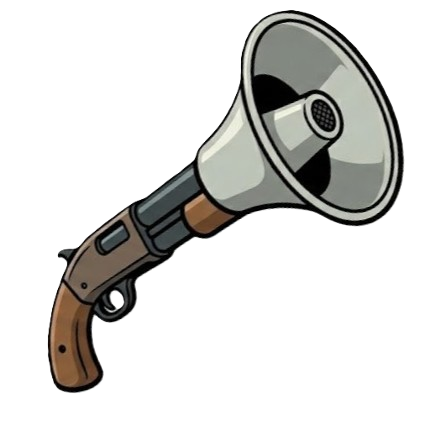

<p align="center">
  <h1>Sawed-off-Socials</h1>
  
</p>

Post a club event once and have it go everywhere: a **Discord** scheduled
event + announcement, a **Google Calendar** entry, an **email** to your member
list, an **Instagram** feed post + story, and any **custom emails** you send
every time (room bookings, newsletter submissions, listservs).

It is a small self-hosted web app: fill in one form, press a button, watch it
happen. Event details are saved so the next event only needs the fields that
changed.

> **Upgrading from 1.x?** See [Upgrading](#upgrading-from-1x) at the bottom.

---

## Quick start

### Docker (recommended for hosting)

```bash
git clone https://github.com/mihir-null/sawed-off-socials.git
cd sawed-off-socials
cp .env.example .env         # fill in the credentials you need (see below)
mkdir -p data && cp custom_emails.example.json data/custom_emails.json   # optional
docker compose up -d --build
```

Open <http://localhost:8000>. Everything the app remembers (uploads, the saved
event, the Google login, custom email templates) lives in `./data`, which is
the only volume you need to back up.

### From source (laptop use)

Requires Python 3.11+ and Node 20+.

```bash
python -m venv venv && source venv/bin/activate    # Windows: venv\Scripts\activate
pip install -r requirements.txt
(cd frontend && npm ci && npm run build)
cp .env.example .env                                # fill it in
python run_app.py                                   # starts the server and opens your browser
```

Data lives in `./data` next to the code. Set `SOS_DATA_DIR` to move it.

### Protecting it

Set `APP_PASSWORD` in `.env` before putting the app on the internet. Without
it anyone who finds the address can post as your club (the UI shows a warning
banner). Officers can additionally sign in with their own Google account once
an existing officer adds their email under **Connections → Officers**. Put the
app behind HTTPS (a reverse proxy such as Caddy or Cloudflare Tunnel is enough).

---

## Using the app

1. Open **Connections** (top right) and connect the club's accounts once:
   **Google** (Calendar + Gmail), **Instagram**, and add the Discord bot to
   your server. The app keeps these logins alive; when one does need
   attention the panel says so and offers **Reconnect**.
2. Fill in the **Event**, **When**, **Destinations** and **Files** cards.
   The small grey tag next to a label says which action needs it. Discord
   server and channel are dropdowns of what the bot can see.
3. Under **Send it**, each button shows *ready* or *Missing: …* so you know
   what is left before you press anything. Buttons that send email or post
   publicly ask for confirmation.
4. A status card appears at the top with live progress, links to what was
   created, who started it, and a plain-English error if something failed.
   The **Logs** button shows the full server log.

**Run everything** does all five actions in order. Steps that are not filled
in (for example no CSV) are reported and the rest still run.

### One club identity, many officers

Everything is posted *as the club*: the club Gmail, the club Instagram, the
club's bot. Who may press the buttons is separate:

- the shared `APP_PASSWORD`, or
- **Sign in with Google** as an officer whose email is listed under
  Connections → Officers. The Google account connected as the club is always
  allowed. Removing an officer signs them out immediately, and every job
  records who started it.

### The actions

| Button | What happens |
| --- | --- |
| **Discord** | Creates a scheduled event (for RSVPs) and posts the description, date/time, location and the image in the chosen channel. `@everyone` is optional. |
| **Calendar** | Creates the event on the named Google Calendar, or your primary calendar if the name is blank or not found. |
| **Email list** | Sends one email per address in the chosen column of the CSV (duplicates and blanks skipped). |
| **Instagram** | Uploads the image to Cloudinary, publishes it as a feed post with the description, then as a story. |
| **Custom emails** | Sends the named templates from `data/custom_emails.json`, filled in with the event details. |

### Fields

| Field | Used by | Notes |
| --- | --- | --- |
| Club / organization | email, templates | Appears in subjects and sign-offs. |
| Event name | everything | |
| Description | Discord, Instagram, Calendar, email | Date, time and location are appended automatically. |
| Location / meeting link | Discord, Calendar, email | Free text: a room, a URL, or both. |
| More info link | all | Optional. |
| Date / Start time / Timezone | Discord, Calendar, email | `YYYY-MM-DD`, 24-hour time. Abbreviations like `EST` are accepted and converted. |
| Duration (hours) | Discord, Calendar | Decimals allowed (`1.5`). |
| Discord server / channel | Discord | Exact names. A leading `#` is fine. |
| Google Calendar name | Calendar | Must match the calendar's name exactly. Blank = primary. |
| Event image | Discord, Instagram | PNG/JPG/GIF/WebP, up to 25 MB. |
| Email list (CSV) + column header | email | Header match is case-insensitive; BOMs from Sheets/Excel are handled. |
| Templates to send | custom | Comma-separated names; or click the chips. |

### Custom emails

`data/custom_emails.json` maps a name to an email. Copy
`custom_emails.example.json` to get started:

```json
{
  "room_booking": {
    "email": "rooms@example.edu",
    "subject": "Room request: {club_name} - {event_name} on {event_date}",
    "body": "Hello,\n\n{club_name} would like to book a room for \"{event_name}\" on {event_date_long} at {event_time_12h}.\n\nThanks,\n{club_name}"
  }
}
```

Any `{field}` from the table above works (use the snake_case names:
`event_name`, `description`, `meeting_link`, `event_date`, `event_time`,
`timezone`, `event_duration`, `club_name`, `calendar_name`, `more_info_link`,
`server_name`, `channel_name`). Two extras are provided: `{event_date_long}`
("Wednesday, March 04, 2026") and `{event_time_12h}` ("6:00 PM EST").
Unknown placeholders are left as-is rather than crashing.

---

## Setting up the platforms

Two kinds of secrets are involved, and keeping them apart makes setup much
less confusing:

| | What it is | Where it goes | Who does it |
| --- | --- | --- | --- |
| **App credentials** | A client id/secret (or bot token) that identifies *this installation* to Google, Meta or Discord | `.env` | whoever hosts the app, once |
| **Account logins** | Which club Gmail / Instagram account the app posts as | the **Connections** panel | any officer, once, or when the panel says "Reconnect" |

Only the services you use need setting up; each action's button tells you
what is missing.

### Google (Calendar + Gmail)

*App credentials, once:*

1. [Google Cloud Console](https://console.cloud.google.com/) → create a
   project → **APIs & Services → Library**: enable **Google Calendar API** and
   **Gmail API**.
2. **OAuth consent screen**: External. Add the club Google account *and every
   officer who will sign in with Google* as test users. Scopes:
   `.../auth/calendar`, `.../auth/gmail.send`, `.../auth/userinfo.email`.
3. **Credentials → Create credentials → OAuth client ID → Web application**.
   Add an *Authorized redirect URI*:
   - local: `http://localhost:8000/api/auth/callback`
   - hosted: `https://your-domain/api/auth/callback`
4. Put the client id/secret in `.env` as `GOOGLE_CLIENT_ID`,
   `GOOGLE_CLIENT_SECRET`, `GOOGLE_PROJECT_ID`, and set
   `GOOGLE_REDIRECT_URI` to the exact URI from step 3.

*Account login, in the UI:* Connections → Google → **Connect**, and sign in
as the club account. The token lives in `data/google_token.json`.

> While the consent screen is in **Testing** status Google expires the login
> every 7 days. To stop the weekly reconnect either publish the app, or, if
> the club account is in a Google Workspace organisation (most universities),
> create the Cloud project there and choose **Internal**.

Gmail limits free accounts to about 500 sends per day; Workspace accounts to
2000.

### Instagram

*App credentials, once:*

1. Your Instagram account must be **Business or Creator**.
2. [Meta for Developers](https://developers.facebook.com/) → **Create app** →
   choose the **Business** type → add the **Instagram** product → **API setup
   with Instagram login**.
3. Under *Business login settings* add the redirect URI
   `https://your-domain/api/instagram/callback` (or the localhost equivalent),
   and under *App roles → Roles* add the club Instagram account as an
   **Instagram Tester** (accept the invite from the Instagram app under
   Settings → Website permissions → Apps and websites → Tester invites).
4. Copy the *Instagram app ID* and *app secret* into `.env` as
   `INSTAGRAM_APP_ID` and `INSTAGRAM_APP_SECRET`.

*Account login, in the UI:* Connections → Instagram → **Connect**, log in as
the club account and approve. The app exchanges the login for a 60-day token
and renews it automatically whenever it posts, so nobody has to touch the Meta
console again.

*Images:* Instagram fetches the image from a public URL. If the app is hosted
at an `https://` address (`SOS_PUBLIC_URL`) it serves the image itself. On a
laptop, or behind plain http, add the `CLOUDINARY_*` variables instead
([free account](https://cloudinary.com/users/register/free)).

*Legacy:* a manually generated Facebook Graph API token still works via
`INSTAGRAM_ACCESS_TOKEN` + `INSTAGRAM_USER_ID` (`python find_insta_id.py`
prints the id).

### Discord

Discord bots have no "log in" flow: the bot *is* the club's identity, and the
token identifies it.

*App credentials, once:*

1. [Discord Developer Portal](https://discord.com/developers/applications) →
   **New Application** → **Bot** → **Reset Token**, copy it to
   `DISCORD_BOT_TOKEN`. No privileged intents are required.

*Adding it to a server, in the UI:* Connections → Discord → **Add bot to a
server**. That opens Discord's own authorisation page with the right
permissions (view channels, send messages, embed links, attach files, mention
everyone, manage events) pre-selected. Afterwards the server and channel
appear in the dropdowns on the form.

## Hosting notes

- `docker-compose.yml` mounts `./data` and reads `.env`. Nothing else needs
  to be mounted.
- The server honours `X-Forwarded-*` headers, so cookies get the `Secure`
  flag behind an HTTPS proxy.
- `GET /api/health` returns `{"status":"ok"}` for uptime checks; the Docker
  image has a built-in health check.
- Set `SOS_SECRET_KEY` to any long random string if you do not want everyone
  to be logged out when the container restarts.
- `SOS_PUBLIC_URL` should be the address people use in their browser. It
  feeds the OAuth redirect URLs and the self-hosted image links.
- Logs go to stderr (`docker logs`) and to the in-app Logs panel.

## Development

```bash
pip install -r requirements-dev.txt
pytest                                   # backend tests
uvicorn backend.main:app --reload        # API on :8000
cd frontend && npm run dev               # UI on :5173, proxies /api to :8000
```

Read [docs/ARCHITECTURE.md](docs/ARCHITECTURE.md) for how the pieces fit
together and where to change message wording, add a field, or add a new
destination. In short: the text of each post lives in
`sawed_off/integrations/<service>.py`; the form fields live in
`sawed_off/models.py` and `frontend/src/components/EventForm.jsx`.

## Upgrading

**From 2.0:** nothing to do. To stop using a manual Instagram token, set
`INSTAGRAM_APP_ID` / `INSTAGRAM_APP_SECRET` and press Connect; the `.env`
token is only used when no connection exists.

**From 1.x:**

- Persistent files moved into `data/`. On first start the app copies
  `event_details.json`, `custom_emails.json`, `token.json` and `uploads/` from
  the old locations if they exist. For Docker, replace the four individual
  bind mounts with `./data:/data`.
- The `custom emails list` field is now `custom_emails` in
  `event_details.json` (migrated automatically; templates using the old
  placeholder still work).
- `.env` variable names are unchanged. `APP_PASSWORD` is new and recommended.
- The Tkinter desktop GUI (`main.py`) and the prebuilt binaries were removed;
  use `python run_app.py` or Docker.

## License

MIT, see [LICENSE](LICENSE).
